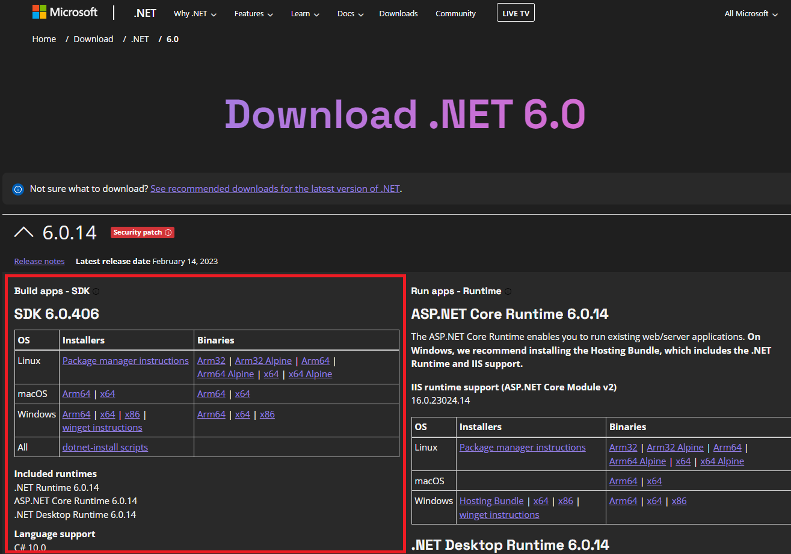
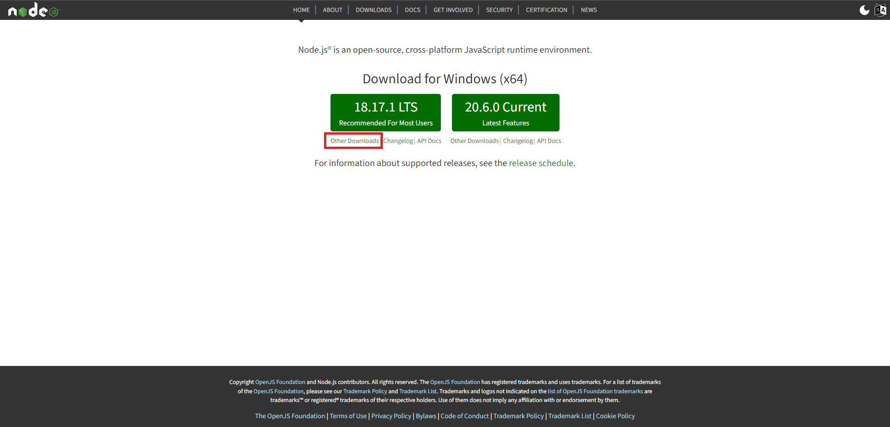
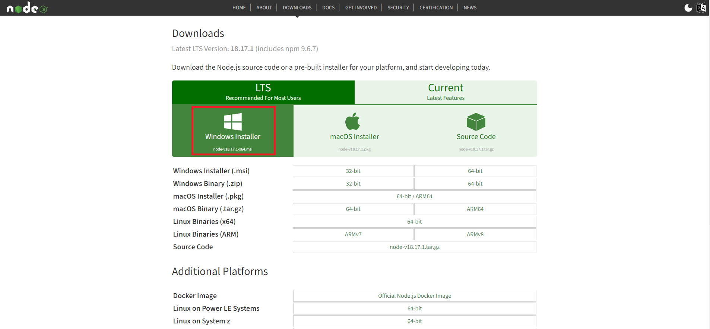
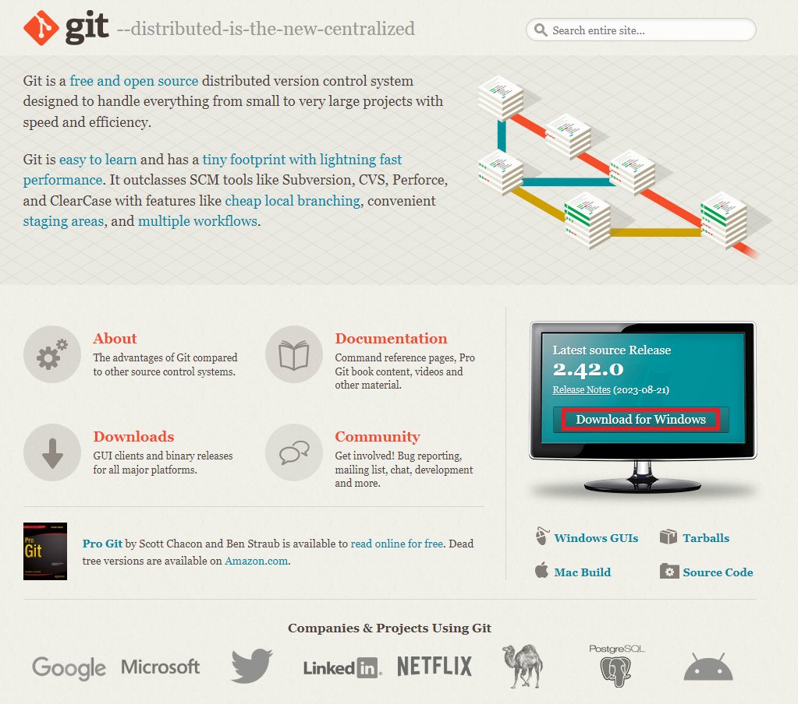
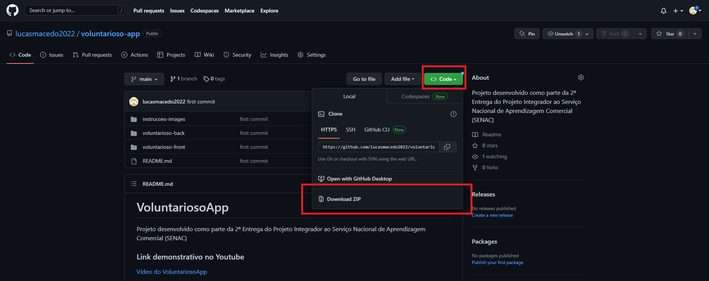
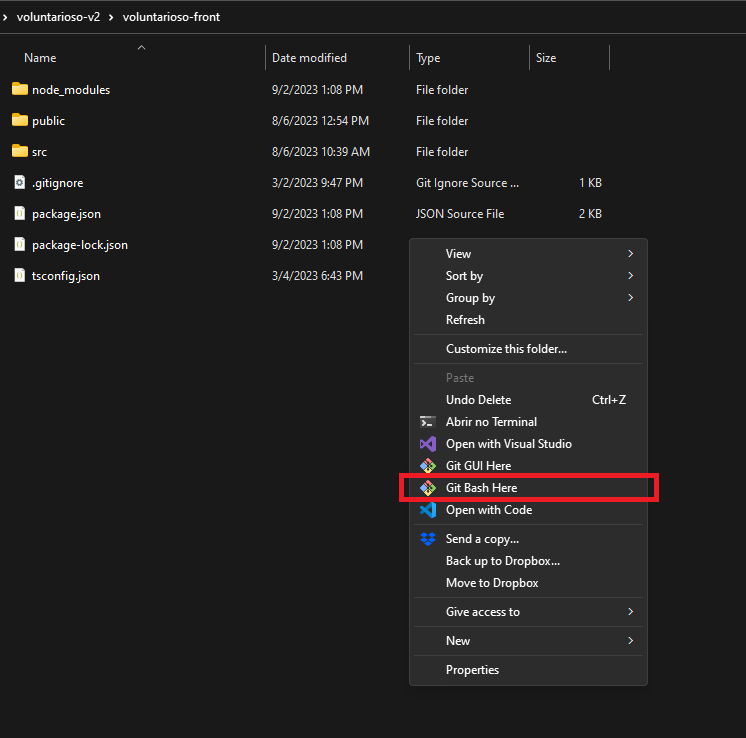
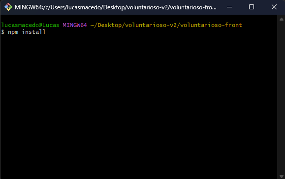
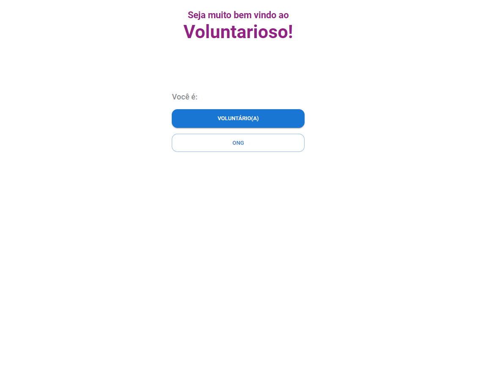

<h1>VoluntariosoApp V2</h1>

Projeto desenvolvido como parte da 2ª Entrega do Projeto Integrador ao Serviço Nacional de Aprendizagem Comercial (SENAC)

<h3>Link demonstrativo no Youtube</h3>
<a href="">Vídeo do VoluntariosoApp</a>

<h3>Integrantes do Time</h3>

<ul>
	<li>Daniel de Barros Silva Sobrinho</li>
	<li>Kassio Cardial Figueredo</li>
	<li>Lucas Macedo de Oliveira</li>
	<li>Renato Rodrigo de Oliveira Vaz</li>
	<li>Tainara Almeida Santos</li>
	<li>Thiago Felipe da Silva</li>
	<li>Victor Hugo dos Santos</li>
</ul>

<h3>Instruções de instalação</h3>

<ol>

<li>
	Certifique-se de instalar o runtime do ASP.NET Core Runtime 6.0.14 (Escolha a versão que corresponde ao seu sistema operacional)
	

		<a href="https://dotnet.microsoft.com/en-us/download/dotnet/6.0">Link do Runtime do ASP.NET Core v6.0</a>
	

</li>

<li>Certifique-se de instalar o runtime do Node.js versão v18.17.0 LTS, caso esteja utilizando Windows x64:
	

		<a href="https://nodejs.org/en/">Link do Runtime do Node.js v18.17.0</a>
	

</li>

<li>Certifique-se de instalar o Git
	

		<a href="https://git-scm.com/downloads">Link do Git</a>
	

</li>

<li>
	Faça o download do código do repositório do GitHub

</li>

<li>
	Extraia a pasta para um caminho válido em seu computador
</li>

<li>
	Vá até a pasta

<code>voluntarioso-v2/voluntarioso-front</code>

</li>

<li>
	Clique com botão direito do mouse na pasta extraída e escolha a opção destacada na imagem

</li>

<li>
	Na linha de comando que abrirá, digite o comando <code>npm install</code>

</li>

<li>
	Ainda na mesma linha de comando e caminho, digite o comando <code>npm run start</code>
</li>

<li>
	Em seu navegador, vá até o endereço <code>http://localhost:3000/</code>
</li>

<li>
	Essa tela será o resultado da aplicação rodando

</li>

<li>
	Fluxo recomendado:
	<ul>
		<li>Comece pelo fluxo das ONGs, acessando a rota: <code>http://localhost:3000/ong</code></li>
		<li>Em seguida, acesse a rota com o fluxo dos voluntários: <code>http://localhost:3000/voluntario</code></li>
	</ul>
</li>

</ol>
